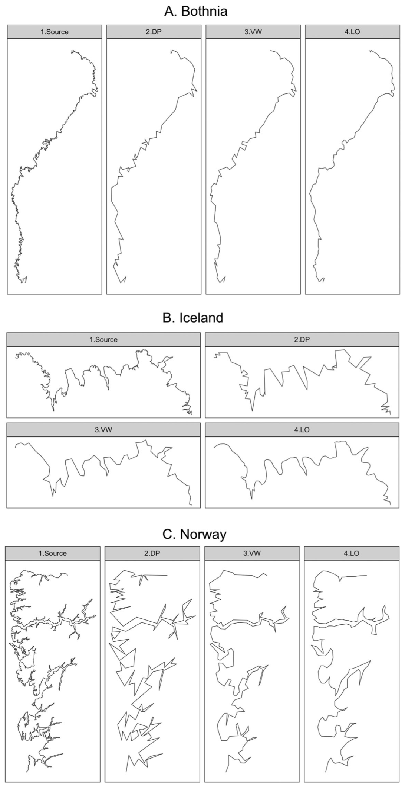

```{r setup, echo=FALSE, include=FALSE}
knitr::opts_chunk$set(fig.height = 9, fig.width = 12, collapse = TRUE, 
                      echo = FALSE, message = FALSE, warning = FALSE)

library(tidyverse)
library(readxl)

tab = read_excel('DetPoll.xlsx', col_types = c('text', 'numeric', 'text', rep('numeric', 6))) %>% 
  mutate_at(1:3, as.factor) %>% 
  pivot_longer(DP:LO, names_to = 'method', values_to = 'detail') %>% 
  pivot_wider(names_from = d, names_prefix = 'd', values_from = detail) %>% 
  filter(d10 > d5 & d20 > d10) %>% 
  pivot_longer(d5:d20, names_to = 'd', names_prefix = 'd', values_to = 'detail') %>% 
  mutate(expr = paste(Area, w1, w2, str_pad(d, 2, side = "left", pad = "0")),
         expr_gen = paste(Area, w1, w2)) %>% 
  group_by(expr, St, Gr) %>%
  mutate(detail_norm = detail - max(detail * (method == 'DP')))
```

# Подготовка и выполнение опроса

В статье 2019 г, опубликованной в рамках настоящего проекта (Samsonov, Yakimova, 2019), было показано, что различными алгоритмами может быть достигнуто сопоставимое (с точностью до ошибок регрессии) изменение метрик, характеризующих геометрическую точность, размер и количество деталей в линии. В эксперименте анализировались алгоритмы Дугласа-Пейкера, Висвалинагм-Уайатта и Ли-Оупеншоу, а также три линии, представляющие участки побережья Ботнического залива (Финляндия), Норвегии и Исландии (Рис. \@ref(fig:srclines)). В качестве метрик анализировалось изменение модифицированного расстояния Хаусдорфа MHD (геометрическая точность как линейное смещение), изменение количества точек, изгибов и длины линии (компрессия деталей), а также изменение извилистости (контроль морфологии линии).

```{r srclines, fig.width = 1, fig.cap='Исходные линии: (A) Ботния, (B) Норвегия, and (C) Исландия (Samsonov, Yakimova, 2019)'}

```

Результаты экспериментов показали, что характер линии оказывает существенное влияние на то, как изменения метрик зависят от величины параметра каждого алгоритма и на то, насколько существенно эти изменения влияют на восприятие детализации линии. Так, например, для линий, обладающих большим количеством малых изгибов и неглубокой иерархией изгибов уменьшение их числа при росте допуска упрощения происходит существенно быстрее, чем для линий с крупными изгибами и развитой иерархией изгибов вне зависимости от алгоритма. В то же время, линии, обработанные разными алгоритмами при условии равенства одной из ограничивающих метрик, визуально могут существенно отличаться по детализации. При этом для одной линии наиболее похожи по детализации результаты, полученные при фиксированном линейном смещении (модифицированное расстояние Хаусдорфа между исходной и генерализованной линией), а для другой линии более похожи результаты, полученные при фиксированном изменении количества изгибов. 

Исходя из этого была выдвинута гипотеза о том, что управляемое изменение детализации линий должно принимать в расчет морфологические особенности линии, а также о том, что необходимо комбинировать разные метрики для достижения сопоставимого уменьшения детализации. В статье данная гипотеза была проверена на примере геометрического упрощения линий Ботнии, Исландии и Норвегии, где для первой линии упрощение контролировалось метрикой MHD, для третьей линии оно контролировалось одинаковым уменьшением количества изгибов, и для второй линии балансировало между ними в соотношении 0.7/0.3. C указанными весами метрик удалось достичь визуально похожей детализации линии (Рис. \@ref(fig:exdet)), однако объективность этих результатов осталась под вопросом.

```{r exdet, fig.cap='Геометрически упрощенные линии при сопоставимом уровне детализации (Samsonov, Yakimova, 2019)'}

```

Для проверки гипотезы был выполнен экспертный опрос студентов, в котором участвовало 20 человек: 9 бакалавров 4 года и 11 магистров 1 года обучения по направлению "Картография и геоинформатика" на Географическом факультете МГУ. На момент прохождения опроса участники уже прошли курс "Картографические базы данных", в рамках которого они подробно знакомятся с алгоритмами картографической генерализации. Таким образом, аудиторию опроса можно считать квалифицированной.

Для выполнения опроса были подготовлены геометрически упрощенные версии исходных трех линий. На первом этапе для алгоритмов Висвалингам-Уайатта и Ли-Оупеншоу были получены регрессионные зависимости между их параметрами и параметром алгоритма Дугласа-Пейкера, обеспечивающие сопоставимое изменение модифицированного расстояния Хаусдорфа и количества изгибов для каждой линии. После этого каждая линия трижды упрощалась каждым алгоритмом при последовательном увеличении допуска алгоритма Дугласа-Пейкера (d = 5, 10, 20) и вычислении соответствующих параметров для двух оставшихся алгоритмов на основе полученных регрессий. При вычислении параметров использовалось три комбинации регрессий с весовыми коэффициентами [0, 1], [0.5, 0.5] и [1, 0] для регрессий по MHD и количеству изгибов соответственно. Таким образом, для каждой линии было получено 27 генерализованных изображений, отличающихся как по степени упрощения, так и по метрике, которая сохраняется в процессе упрощения. Итого суммарно 81 изображение.

Изображения были упорядочены группами по 4 шт, где крайнее левое изображение соответствует исходной линии, а последующие три являются его генерализованными версиями, полученными алгоритмами Дугласа-Пейкера, Висвалингам-Уайатта и Ли-Оупеншоу соответственно. Всего на листе А4 располагалось 3 таких группы сверху вних, соответствующих величине параметра алгоритма Дугласа-Пейкера (d = 5, 10, 20), а каждый лист соответствовал используемой комбинации весовых коэффициентов регрессий [0, 1], [0.5, 0.5] и [1, 0]. Таким образом, студентам было роздано 9 листов по 12 изображений.

```{r ex, fig.cap='Пример опросного листа по детализации линий'}

```

Задачей респондентов было дать численную оценку детализации каждого изображения, основываясь на личном восприятии. Число необходимо было подписать рядом с самим изображением. Шкала измерения уровня детализации подчинялась следующим принципам:

- От 1 до 10, где 1 — самое детальное изображение, 10 — самое обобщенное
- Детализация исходного изображения (№1) принимается равной 1. Это изображение повторяется в каждой группе из четырех изображений.
- Баллы проставляются кратно 0.5. То есть, возможна величина как 5, так и 5.5
- Несколько изображений могут иметь одинаковую детализацию (как из одной строки, так и из разных строк).
- Максимальная величина может быть меньше 10. Допустимо присвоить максимально генерализованному изображению более низкий балл (например, 8) и распределить все баллы между ним и 1 (исходное изображение).

Критериями оценки детализации служили две характеристики:

- Количество деталей (изгибов линии): чем их больше, тем меньше будет балл детализации. На обобщенных изображениях не должно быть много деталей.
- Размер деталей (ширина, глубина): чем меньше самый малый видимый изгиб, тем меньше будет балл детализации. На обобщенных изображениях не должно быть мелких деталей.

Морфология деталей (их гладкость/угловатость) не должна была оказывать большого влияния на выбор. Респондентов просили абстрагироваться от оценки угловатости линий и сравнивать их только по количеству и размеру отображаемых деталей.

Результаты опроса были упорядочены в виде таблицы, фрагмент которой для одного респондента представлен в Таблице \@ref(tab:res)

```{r res}
knitr::kable(tab[1:27, 1:8], caption = 'Фрагмент таблицы результатов оценки уровня детализации (на примере одного респондента).')
```

# Анализ полученных результатов

Перед выполнением анализа данные были подвержены фильтрации, которая заключалась в исключении случаев, когда оценки детализации трех изображений одной линии на одной странице, соответствующих допускам упрощения 5, 10, 20, не образуют монотонно растущей прогрессии. С учетом очевидности уменьшения детализации в этих прогрессиях, подобные случаи могли быть следствием невнимательности, усталости или недобросовестного выполнения задания. Также встречались случаи, когда оценка вообще не была проставлена. Из 1620 оценок таким образом было отбраковано 23.

Анализируя полученные оценки, мы пытались понять, при каких условиях респонденты оценивают изображения как имеющие одинаковую детализацию. Для этого мы сначала агрегировали оценки, полученные для каждого изображения (в среднем по 20 оценок, за исключением отбракованных случаев). На Рис. \@ref(fig:abs-all) представлены диаграммы размаха по всем 27 группам линий. Заголовок каждого графика построен по шаблону `<участок> <вес MHD> <вес изгибов> <допуск упощения>`. Например, самый первый заголовок `Bothnia 0 1 05` означает, что это оценки для линии Ботния, полученной при нулевом весе MHD и единичном весе изгибов с допуском упрощения для алгоритма Дугласа-Пейкера $d = 5$. Таким образом, каждая тройка соседних по горизонтали графиков соответствует одному опросному листу.

```{r abs-all, fig.cap='Абсолютная детализация геометрически упрощенных линий (все студенты)'}
tab %>% 
  ggplot() +
  geom_boxplot(mapping = aes(y = detail, fill = method)) +
  ylim(0, 10) +
  facet_wrap(~expr, ncol = 9) +
  labs(title = 'Абсолютная детализация геометрически упрощенных линий',
       subtitle = 'Все респонденты')
```

Анализ данных графиков позволяет видеть, что даже с учетом независимой простановки оценок во всех случаях по мнению респондентов детализация уменьшается при увеличении допуска упрощения, если сравнивать диаграммы для одного алгоритма. В то же время, есть случаи, когда детализация, полученная одним алгоритмом при меньшем допуске, оценивалась в среднем как менее детальная, чем детализация, полученная другим алгоритмом при вдвое большей величине допуска. Таким примером является линия Norway (левый нижний угол Рис. \@ref(fig:abs-all)), которая наглядно показывает, что алгоритм Ли-Оупеншоу очень быстро уменьшает детализацию сложной по структуре линии в случае когда ограничивающим критерием является совпадение количества изгибов. Также можно обратить внимание на то, что в большинстве случаев алгоритм Дугласа-Пейкера дает наиболее детальное изображение и практически никогда не оценивается как самый грубый, за исключеним случая с приоритетом геометрической точности (MHD), который располагается в правом нижнем углу Рис. \@ref(fig:abs-all) Данный случай наглядно характеризует особенности алгоритма Дугласа-Пейкера, который при сопоставимых других характеристиках всегда "обыгрывает" другие алгоритмы по показателям геометрической точности, то есть дает линию, наименее отклоняющуюся от исходной по метрике линейного смещения. В обратном случае — когда это отклонение сопоставимо с результатами других алгоритмов, линия, полученна алгоритмом Дугласа-Пейкера получается существенно более грубой для восприятия. Однако, как видно из графиков, это суждение верно только для линии со сложной иерархией изгибов. Для Исландии и Ботнии такого эффекта не наблюдается, что свидетельствует о влиянии морфологии линии на результат оценки детализации.

Чтобы оценить, нет ли систематических отличий в выборках, полученных для бакалавров и магистров, мы выполнили аналогичный анализ для них по отдельности, полученные графики представлены на Рис. \@ref(fig:abs-bac) и Рис. \@ref(fig:abs-mag). Можно видеть, что основным отличием выборок является более высокое среднеквадратическое отклонение оценок для бакалавров ("ящики" на диаграммах размаха у них более широкие). В остальноме же картина получилась схожая.

```{r abs-bac, fig.cap='Абсолютная детализация геометрически упрощенных линий (бакалавры)'}
tab %>% 
  filter(Gr == 'B') %>% 
  ggplot() +
  geom_boxplot(mapping = aes(y = detail, fill = method)) +
  ylim(0, 10) +
  facet_wrap(~expr, ncol = 9) +
  labs(title = 'Абсолютная детализация геометрически упрощенных линий',
       subtitle = 'Бакалавры')
```

```{r abs-mag, fig.cap='Абсолютная детализация геометрически упрощенных линий (магистры)'}
tab %>% 
  filter(Gr == 'M') %>% 
  ggplot() +
  geom_boxplot(mapping = aes(y = detail, fill = method)) +
  ylim(0, 10) +
  facet_wrap(~expr, ncol = 9) +
  labs(title = 'Абсолютная детализация геометрически упрощенных линий',
       subtitle = 'Магистры')
```

Основной вывод, который был сделан по результатам первичного анализа абсолютных метрик, заключается в том, что, несмотря на то, что интерквартильные размахи на графиках во многих случаях существенно пересекаются, практически ни в одном из них не наблюдается совпадение медиан или средних значений детализации. Одной из причин, которые обуславливают нестабильность оценок, является то, что каждый респондент по-своему распределял баллы детализации между тремя уровнями упрощения, и линия, которая получала балл 4 у одного респондента, могда получить баллы 2.5 и 6 у других. В то же время, целью эксперимента являлось не сравнение абсолютных отметок разных респондентов, а выявление случаев, когда респондент ставил изображениям в одной группе одинаковые баллы — то есть, оценивал их детализацию как идентичную. Поэтому на следующем этапе анализа мы перешли от абсолютных баллов к относительным.

Относительные баллы детализации были получены в каждой группе из трех изображений (одинаковые параметры, но разные алгоритмы) путем разности их детализации и детализации изображения, полученного алгоритмом Дугласа-Пейкера. В этом случае все линии, полученные указанным алгоритмом получали оценку 0, а для оставшихся двух могли принимать как положительные, так и отрицательные значения в зависимости от величины отклонения. Результирующие графики представлены на Рис. \@ref(fig:rel-all).

```{r rel-all, fig.cap='Относительная детализация геометрически упрощенных линий (все респонденты)'}
tab %>% 
  ggplot() +
  geom_boxplot(mapping = aes(y = detail_norm, fill = method)) +
  ylim(-5, 5) +
  facet_wrap(~expr, ncol = 9) +
  labs(title = 'Относительная детализация геометрически упрощенных линий',
       subtitle = 'Все респонденты')
```

Анализ графиков относительной детализации позволил сделать следующие выводы:

- При более грубых уровнях детализации увиличивается нестабильность оценок: медиана сильнее отклояется от 0, увиличивается интерквартильных размах.
- Алгоритм Висвалингам оказался в среднем более управляемым, нежели алгоритм Ли-Оупеншоу, его оценки детализации в большем количестве случае оказались близкими к оценкам алгоритма Дугласа-Пейкера.
- Для каждой из трех линий можно наметить комбинации весов регрессий, которые дают наиболее удовлетворительные результаты. Для Ботнии это комбинация [1, 0], для Норвегии [0.5, 0.5], а для Исландии результат до конца не очевиден, необходим дальнейший анализ для выбора между [0.5, 0.5] и [1, 0].

Так же как и для абсолютных оценок, аналогичные визуализации по относительным оценкам были сделаны отдельно по выборкам для групп бакалавров и магистров. Они представлены на Рис. \@ref(fig:rel-bac) и Рис. \@ref(fig:rel-mag). Выводы, сделанные по общей выборке, они подтверждают, однако показывают, что оценки, сделанные магистрами отличаются меньшей стабильностью, особенно для линии Норвегия, для которой большинство графиков имеют интерквартильный размах в 2 и более балла. 

То есть, получилось, что бакалавры подшли более разнопланово к шкалированию уровней детализации (большой разброс баллов между респондентами для одного изображения), но при этом более часто чем магистры оценивали расположенные рядом изображения как имеющие близкую детализацию (меньший разброс баллов для одного респондента но между изображениями).

```{r rel-bac, fig.cap='Относительная детализация геометрически упрощенных линий (бакалавры)'}
tab %>% 
  filter(Gr == 'B') %>% 
  ggplot() +
  geom_boxplot(mapping = aes(y = detail_norm, fill = method)) +
  ylim(-5, 5) +
  facet_wrap(~expr, ncol = 9) +
  labs(title = 'Относительная детализация геометрически упрощенных линий',
       subtitle = 'Бакалавры')
```

```{r rel-mag, fig.cap='Относительная детализация геометрически упрощенных линий (магистры)'}
tab %>% 
  filter(Gr == 'M') %>% 
  ggplot() +
  geom_boxplot(mapping = aes(y = detail_norm, fill = method)) +
  ylim(-5, 5) +
  facet_wrap(~expr, ncol = 9) +
  labs(title = 'Относительная детализация геометрически упрощенных линий',
       subtitle = 'Магистры')
```

На заключительном этапе анализа мы выполнили еще две итерации агрегирования относительных данных. Для начала мы исключили данные по алгоритму Дугласа-Пейкера (которые равны 0) и построили общие диаграммы размаха, чтобы посмотреть на совокупный разброс по двум оставшимся алгоритмам для каждого случая. Полученные результаты представлены на Рис. \@ref(fig:rel-all-nodp). На данном рисунке каждой линии отведен свой столбец графиков и нанесена красная линия, показывающая желаемое (эталонное) значение относительного отклонения по детализации, равное нулю. Группа из трех соседних по вертикали графиков соответствует последовательности геометрических упрощений, полеченных для одной линии при фиксированном сочетании весов регрессий. 

```{r rel-all-nodp, fig.cap='Относительная детализация линий, полученных алгоритмами Висвалингам и Ли-Оупеншоу'}
tab %>% 
  filter(method != 'DP') %>% 
  ggplot() +
  geom_boxplot(mapping = aes(y = detail_norm)) +
  geom_hline(yintercept = 0, color = 'red', size = 1) +
  ylim(-5, 5) +
  coord_flip() +
  facet_wrap(~expr, ncol = 3, dir = 'v') +
  labs(title = 'Относительная детализация линий, полученных алгоритмами Висвалингам и Ли-Оупеншоу',
       subtitle = 'Все респонденты')
```

Анализ Рис. \@ref(fig:rel-all-nodp) подтверждает ранее сделанное предположение, что наиболее близкие по детализации линии получаются для Ботнии и Норвегии при весах регрессий, равных соответственно [1, 0] и [0.5, 0.5]. Также данный уровень агрегирования позволил сделать вывод о том, что для Исландии оптимальным является сочетание весов [1, 0], так как для него сразу по двум уровням детализации медиана относительного отклонения равна нулю, в то время как для комбинации [0.5, 0.5] на всех уровнях медиана ненулевая. Построение аналогичных графиков отдельно для бакалавров (Рис. \@ref(fig:rel-bac-nodp)) и магистров (Рис. \@ref(fig:rel-mag-nodp)) в целом подтверждает данный вывод, однако по данным бакалавров детализация по Исландии для случая [0.5, 0.5] успешно конкурирует по устойчивости с комбинацией [1, 0].

```{r rel-bac-nodp, fig.cap='Относительная детализация линий, полученных алгоритмами Висвалингам и Ли-Оупеншоу (бакалавры)'}
tab %>% 
  filter(method != 'DP', Gr == 'B') %>% 
  ggplot() +
  geom_boxplot(mapping = aes(y = detail_norm)) +
  geom_hline(yintercept = 0, color = 'red', size = 1) +
  ylim(-5, 5) +
  coord_flip() +
  facet_wrap(~expr, ncol = 3, dir = 'v') +
  labs(title = 'Относительная детализация линийm, полученных алгоритмами Висвалингам и Ли-Оупеншоу',
       subtitle = 'Бакалавры')
```

```{r rel-mag-nodp, fig.cap='Относительная детализация линий, полученных алгоритмами Висвалингам и Ли-Оупеншоу (магистры)'}
tab %>% 
  filter(method != 'DP', Gr == 'M') %>% 
  ggplot() +
  geom_boxplot(mapping = aes(y = detail_norm)) +
  geom_hline(yintercept = 0, color = 'red', size = 1) +
  ylim(-5, 5) +
  coord_flip() +
  facet_wrap(~expr, ncol = 3, dir = 'v') +
  labs(title = 'Относительная детализация линий, полученных алгоритмами Висвалингам и Ли-Оупеншоу',
       subtitle = 'Магистры')
```

Финальная серия графиков, представленная на Рис. \@ref(fig:rel-all-nodp-nodet) показывает данные, агрегированные не только по алгоритмам, но и по уровням детализации. Из нее можно сделать вывод о наиболее оптимальном сочетании весов [1, 0], [1, 0] и [0.5, 0.5] для Ботнии, Исландии и Норвегии. Как и на предыдущих стадиях анализа, выборка по бакалаврам (Рис. \@ref(fig:rel-bac-nodp-nodet)) не позволяет сделать однозначного выбора между [1, 0] и [0.5, 0.5] для Исландии, а выборка по магистрам (Рис. \@ref(fig:rel-mag-nodp-nodet)) дает тот же результат, хотя и менее устойчивый (ни одна медиана не равняется нулю).

```{r rel-all-nodp-nodet, fig.height = 4, fig.width = 12, fig.cap='Относительная детализация линий, полученных алгоритмами Висвалингам и Ли-Оупеншоу на всех уровнях упрощения (все респонденты)'}
tab %>% 
  filter(method != 'DP') %>% 
  ggplot() +
  geom_boxplot(mapping = aes(y = detail_norm)) +
  geom_hline(yintercept = 0, color = 'red', size = 1) +
  ylim(-5, 5) +
  coord_flip() +
  facet_wrap(~expr_gen, ncol = 3, dir = 'v') +
  labs(title = 'Относительная детализация геометрически упрощенных линий',
       subtitle = 'Все респонденты')
```

```{r rel-bac-nodp-nodet, fig.height = 4, fig.width = 12, fig.cap='Относительная детализация линий, полученных алгоритмами Висвалингам и Ли-Оупеншоу на всех уровнях упрощения (бакалавры)'}
tab %>% 
  filter(method != 'DP', Gr == 'B') %>% 
  ggplot() +
  geom_boxplot(mapping = aes(y = detail_norm)) +
  geom_hline(yintercept = 0, color = 'red', size = 1) +
  ylim(-5, 5) +
  coord_flip() +
  facet_wrap(~expr_gen, ncol = 3, dir = 'v') +
  labs(title = 'Относительная детализация геометрически упрощенных линий',
       subtitle = 'Бакалавры')
```

```{r rel-mag-nodp-nodet, fig.height = 4, fig.width = 12, fig.cap='Относительная детализация линий, полученных алгоритмами Висвалингам и Ли-Оупеншоу на всех уровнях упрощения (магистры)'}
tab %>% 
  filter(method != 'DP', Gr == 'M') %>% 
  ggplot() +
  geom_boxplot(mapping = aes(y = detail_norm)) +
  geom_hline(yintercept = 0, color = 'red', size = 1) +
  ylim(-5, 5) +
  coord_flip() +
  facet_wrap(~expr_gen, ncol = 3, dir = 'v') +
  labs(title = 'Относительная детализация геометрически упрощенных линий',
       subtitle = 'Магистры')
```

# Выводы

На основании проведенного анализа были сделаны следующие выводы:

1. Линии, воспринимаемые респондентами как имеющие схожую детализацию, могут быть получены разными алгоритмами, однако выбор метрики, использующейся в качестве ограничения, зависит от характера линии. В частности, для линий, имеющих неглубокую иерархию изгибов, размеры которых малы в сравнении с длиной всей линии (Ботния), наиболее схожие по детализации результаты получаются при использовании линейного смещения в качестве ограничивающей метрики (в нашем случае за его оценку отвечает модифицированное расстояние Хаусдорфа). При увеличении сложности линии большую роль начинает играть такая метрика как уменьшение количества изгибов. Для участка береговой линии Норвегии наиболее оптимальным среди проанализированных оказалось равное соотношение между расстоянием и количеством изгибов [0.5, 0.5], в то время как для Исландии, занимающей промежуточное положение по сложности иерархии изгибов, это соотношение колеблется между [1, 0] и [0.5, 0.5] в зависимости от того, используется ли полная выборка или одна из двух однородных подвыборок респондентов (бакалавры, магистры).

2. Гипотеза о соотношении весов ограничивающих метрик (используемых при осреднении параметров уравнений регрессии), ранее выдвинутая в статье (Samsonov, Yakimova, 2019), подтвердилась частично. Наше предположение состояло в том, что для Ботнии, Исландии и Норвегии оно составляет [1, 0], [0.7, 0.3] и [0.5, 0.5]. Сравнивая эти цифры с результатами анализа экспертного опроса, можно сделать вывод, что для Ботнии и Исландии оно оправдалось, а для Норвегии мы недооценили важность контроля отклонения линии от исходной как косвенной характеристики уменьшения детализации.

3. Гипотеза о возможности комбинирования разных метрик для получения линий сопоставимой детализации, подтвердилась, поскольку для одной из трех линий наилучший результат устойчиво получился при комбинации линейного смещения и уменьшения количества изгибов. 

4. Из двух метрик — линейного смещения по метрике модифицированного расстояния Хаусдорфа и уменьшения количества изгибов — метрика линейного смещения является более показательной при характеристике изменения детализации линии, поскольку ни один из результатов опроса не показал возможность применения только уменьшения количества изгибов как эффективной характеристики изменения детализации.


