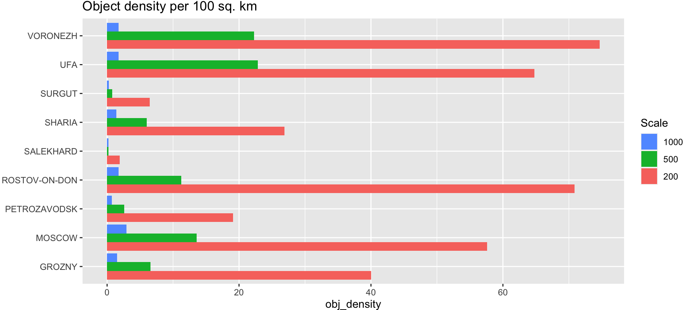

# Motivation and background

1. __Level of detail__ (LoD) concept is used to describe how close are spatial objects and their cartographic representations to the full description of reality.

2. There are some successful attempts to formalize the LoD notion, for example in 3D city modeling (e.g. Biljecki et al., 2014, 2016).

3. However, in general cartography the LoD remains a vaguely defined and weakly investigated concept, which prohibits its widespread application.
    
    - Ruas and Bianchin (2002) define LoD of a spatial database as a combination of the conceptual schema of the data, the semantic resolution, the geometric resolution, the geometric precision, and the granularity.
    
    - In a series of papers Touya and colleagues developed an approach to infer the LoD of OSM spatial features  based on multicriteria analysis (Touya & Brando-Excobar, 2013), inverted radical law (Touya & Reimer, 2015), and to define scale of a map using deep learning (Touya et al., 2020).
    
---

# LoD research problems in cartography

1. No general standard on describing the LoD of a digital map / spatial database.

2. Existing formalizations are "backward", i.e. aimed at estimating the LoD of existing data. At the same time, "forward" LoD specifications are needed to generate maps/spatial data of desired detail.

3. ...

3. __Since real objects and landscapes differ in their complexity, so do their cartographic representations. Can we confuse more complex representations with more detailed representations?__

The last research problem is investigated in our research.

---

# Hypothesis

1. Geometric components of LoD such as feature density, resolution and granularity are affected not only by detail of representation but also by complexity of represented landscape.

1. It is possible to erroneously judge cartographic representations of two landscapes with different complexities as two representations having different levels of detail.

1. If we know how landscape complexity varies in space, we can reduce the bias in LoD estimation by normalizing geometric measures on predicted landscape complexity.

1. Such normalization will lead to more robust LoD formalization suitable for comparing not only maps of the same territory, but also maps covering different areas.

---

# Experimental setup

1. Select geographic areas in different landscapes.

1. Extract corresponding data from multiple LoDs of cartographic database.

1. Compute geometric measures of detail for each extracted fragment. 

1. Check if the LoDs can be effectively distinguished based on statistical summaries of obtained measure values.

1. Evaluate the landscape complexity for each fragment using the independent data source.

1. Normalize each measure on its mean value and construct the regression model between normalized value (_excess_) and landscape complexity.

1. Using the derived model, predict for each map fragment the excess of each measure: i.e. _how much higher or lower it is than the mean_.

1. Divide each measure on its predicted excess.

1. Check if the LoDs distinction improves based on excess-divided values.

---

# Geographic areas


---

# Experimental data and detail measures

__Data:__ 

- For each area the data from three levels of detail from cartographic database were extracted: 200k, 500k, 1000k

- Currently  performed investigation  included  the  subset  of  topographic  data  which  characterizes  the  _socio-economic infrastructure_:  settlement  boundaries,  settlement  block  structure,  roads  and  railways, engineering networks and administrative boundaries

__Detail measures__:

- _Size_: mean bend width, mean bend height, average object area

- _Density_: feature vertex density, feature density, intersection density

> Density measures will be explored in current presentation

<!-- --- -->

<!-- # LoD distinction (absolute measures) -->

<!--  -->

<!-- --- -->

<!-- # LoD distinction (absolute measures) -->

<!--  -->

<!-- --- -->

<!-- # LoD distinction (absolute measures) -->

<!--  -->

<!-- --- -->

<!-- # LoD distinction (absolute measures) -->

<!--  -->

<!-- --- -->

<!-- # LoD distinction (absolute measures) -->

<!-- Student test on mean equality: -->

<!--  -->

---

# LoD distinction (density measures)


---

# LoD distinction (density measures)



---

# LoD distinction (density measures)


---

# LoD distinction (density measures)


---

# LoD distinction (density measures)

Student test on mean equality:


---

# Landscape complexity

Copernicus Global Land Cover (CGLC) 100 m raster database
[https://land.copernicus.eu/global/](https://land.copernicus.eu/global/)


---

# Landscape complexity

Based on CGLC the following characteristics were calculated for each area:

- Entropy-based measures as general estimators of complexity 

- The percentage of area occupied by urban and agricultural (crops) land cover types as specific predictors of complexity conditioned by human activity.

> Currently the urban/crops ratio was used.


---

# Grozny

```{r, echo = FALSE}
metrics = dplyr::mutate_if(readxl::read_excel('data/metrics.xlsx'), is.numeric, round, digits = 2)
knitr::kable(dplyr::filter(metrics, name == 'GROZNY'))
```


---

# Moscow

```{r, echo = FALSE}
knitr::kable(dplyr::filter(metrics, name == 'MOSCOW'))
```


---

# Petrozavodsk

```{r, echo = FALSE}
knitr::kable(dplyr::filter(metrics, name == 'PETROZAVODSK'))
```


---

# Rostov

```{r, echo = FALSE}
knitr::kable(dplyr::filter(metrics, name == 'ROSTOV-ON-DON'))
```


---

# Salekhard

```{r, echo = FALSE}
knitr::kable(dplyr::filter(metrics, name == 'SALEKHARD'))
```


---

# Sharia

```{r, echo = FALSE}
knitr::kable(dplyr::filter(metrics, name == 'SHARIA'))
```


---

# Surgut

```{r, echo = FALSE}
knitr::kable(dplyr::filter(metrics, name == 'SURGUT'))
```


---

# Ufa

```{r, echo = FALSE}
knitr::kable(dplyr::filter(metrics, name == 'UFA'))
```


---

# Voronezh

```{r, echo = FALSE}
knitr::kable(dplyr::filter(metrics, name == 'VORONEZH'))
```


---

# Density vs. urban-crops models

These models show the dependence between density of vertices/objects/intersections and percentage occupied by urban/crop lands 


---

# Density vs. urban-crops models

These models show the dependence between density of vertices/objects/intersections and percentage occupied by urban/crop lands 


---

# Density vs. urban-crops models

These models show the dependence between density of vertices/objects/intersections and percentage occupied by urban/crop lands 


---

# Density vs. urban-crops excess models

__Excess__ of the $j$-th measure for $i$-th map fragment is calculated by dividing its value on the mean value for all map fragments:

$$\hat m_{ij} = m_{ij} / m_j,~\text{where}~m_j = \frac{\sum_{i = 1}^{n} m_{ij}}{n}$$
$m_{ij} = 2$ means that $j$-th measure for $i$-th map fragment is two times larger than the average for this LoD.


---

# Density vs. urban-crops excess models

__Excess__ of the $j$-th measure for $i$-th map fragment is calculated by dividing its value on the mean value for all map fragments:

$$\hat m_{ij} = m_{ij} / m_j,~\text{where}~m_j = \frac{\sum_{i = 1}^{n} m_{ij}}{n}$$
$m_{ij} = 2$ means that $j$-th measure for $i$-th map fragment is two times larger than the average for this LoD.


---

# Density vs. urban-crops excess models

__Excess__ of the $j$-th measure for $i$-th map fragment is calculated by dividing its value on the mean value for all map fragments:

$$\hat m_{ij} = m_{ij} / m_j,~\text{where}~m_j = \frac{\sum_{i = 1}^{n} m_{ij}}{n}$$
$m_{ij} = 2$ means that $j$-th measure for $i$-th map fragment is two times larger than the average for this LoD.


---

# Density vs. urban-crops excess correlation


---

# Density vs. urban-crops excess models

Explored model is:

$$d_i = \alpha_i + \beta_i \log(u + 1) + \gamma_i \log(c + 1),$$

where $d_i$ — value of $i$-th measure excess, $u$ — urban ratio, $с$ — crops ratio.


---

# LoD distinction (density measures)

__Raw measure__


---

# LoD distinction (density measures)

__Normalized on predicted excess__


---

# LoD distinction (density measures)

__Raw measure__


---

# LoD distinction (density measures)

__Normalized on predicted excess__


---

# LoD distinction (density measures)

__Raw measure__


---

# LoD distinction (density measures)

__Normalized on predicted excess__


---

# LoD distinction (density measures)


---

# LoD distinction (density measures)


---

# LoD distinction (density measures)

Student test on mean equality:


---

# Conclusions

1. Spatial heterogeneity of landscapes complicates estimation of map or spatial data LoD. Representations of more complex landscapes can be erroneously judged as more detailed representations.

2. External knowledge on landscape complexity is needed to reduce the bias in LoD estimation. Land use/land cover global datasets can be used to gain this knowledge.

3. Percentage of area occupied by urban and agricultural land use/land cover types can be used as a proxy measure of landscape complexity induced by human activity (i.e. socio-economic map elements).

4. Regression modeling of dependence between spatial density of vertices/objects/intersections and urban/crops ratio predicts excess of density over the mean LoD density.

5. Normalization of density measures on predicted excess allows better distinction of LoDs from a statistical point of view. 

6. Further research is needed to investigate the dependency of LoD measures on landscape complexity metrics and to predict the detail excess for the full set of map elements, including natural components.